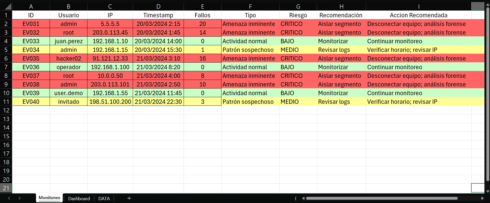
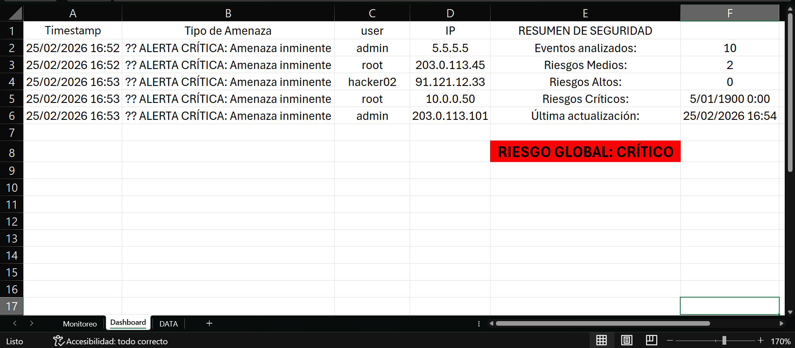
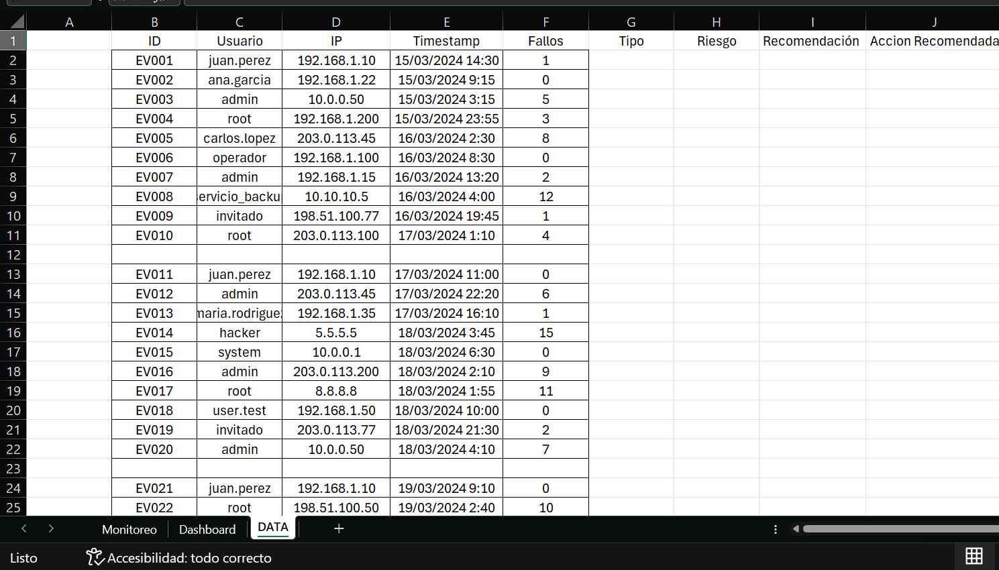

# 🛡️ CiberDefensa con IA Local (Ollama) - Excel + VBA

Sistema de análisis de eventos de seguridad desarrollado en **Excel VBA**,
capaz de integrar **IA local mediante Ollama (LLaMA3 u otros modelos)**
o funcionar en modo heurístico offline.
---

##  Ejecutar el sistema

1. Ir a la carpeta `release/`
2. Descargar `CiberDefensa-IA-Ollama.xlsm`
3. Habilitar macros
4. Ejecutar `EjecutarAnalisisIA`

---

## ¿Qué hace este proyecto?

Simula un entorno básico tipo SOC (Security Operations Center):

- Analiza eventos de login sospechosos
- Clasifica el nivel de riesgo: BAJO, MEDIO, ALTO, CRÍTICO
- Sugiere acciones automáticas
- Genera alertas críticas
- Actualiza un Dashboard dinámico
- Permite cancelación en ejecución
- Funciona con IA local o sin conexión

---

## 🧠 Modos de Funcionamiento

### 1️⃣ Modo IA (Ollama Local)

Si Ollama está activo en:

bash: `http://localhost:11434`


El sistema:
- Envía el evento al modelo (ej: llama3)
- Recibe análisis estructurado
- Parsea la respuesta
- Clasifica riesgo y acción

Formato esperado:
___
RIESGO | ACCIÓN | MOTIVO | RECOMENDACIONES  
___


### Modo Heurístico (Offline)
Si Ollama no responde:
- Se activa un sistema de scoring interno
- Evalúa:
    - Número de fallos
    - Horario sospechoso
    - IP conocida
    - Usuario privilegiado
- Calcula nivel de riesgo automáticamente
---
## Dashboard
El sistema genera:
- Conteo de riesgos medios, altos y críticos
- Termómetro de riesgo global
- Registro automático de alertas críticas
- Timestamp de última actualización


---

## Data

Datos Pre-Cargados para usar en el sistema


---
## Tecnologías Utilizadas
- Excel VBA
- WinHttpRequest
- Ollama (IA local)
- Modelo LLaMA3 (configurable)
---
## Configuración
En el código puedes modificar:
```vb
Private Const OLLAMA_MODEL As String = "llama3"
Private Const TIMEOUT_SEGUNDOS As Long = 8
```

